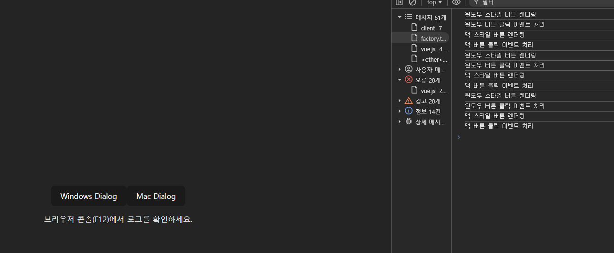
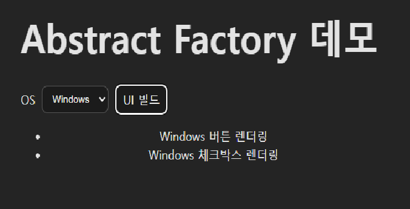

# 객체지향 디자인패턴

## 기본 예제 실행 이미지

1. singleton


2. factory


3. adapter


4. decorator


5. observer


6. visitor


## 실습 구현 과제

1. abstract-factory
   
   
```

연관성이 있는 객체 군이 여러개 있을 경우 이들을 묶어 추상화하고, 
어떤 구체적인 상황이 주어지면 팩토리 객체에서 집합으로 묶은 
객체 군을 구현화 하는 생성 패턴

핵심은 제품 '군' 집합을 타입별로 찍을 수 있다는것
```
2. facade
   
```

요약 : 복잡한 서브 클래스들의 공통적인 기능을 정의하는 상위 수준의 인터페이스를 제공하는 패턴입니다.

퍼사드 객체는 서브 클래스의 코드에 의존하는 일을 감소시켜 주고, 
복잡한 소프트웨어를 간단히 사용 할 수 있게 간단한 인터페이스를 제공

서브 시스템들 간의 종속성을 줄여줄 수 있으며, 
퍼사드 객체를 사용하는 곳(Client)에서는 
여러 서브 클래스들을 호출할 필요 없이 편리하게 사용

```
3. strategy
   
```

객체들이 할 수 있는 행위 각각에 대해 전략 클래스를 생성하고, 
유사한 행위들을 캡슐화 하는 인터페이스를 정의하여,
객체의 행위를 동적으로 바꾸고 싶은 경우 직접 행위를 수정하지 않고 
전략을 바꿔주기만 함으로써 행위를 유연하게 확장하는 방법을 말합니다.

간단히 말해서 객체가 할 수 있는 행위들 각각을 전략으로 만들어 놓고, 
동적으로 행위의 수정이 필요한 경우 전략을 바꾸는 것만으로 행위의 수정이 가능하도록 만든 패턴입니다.
```